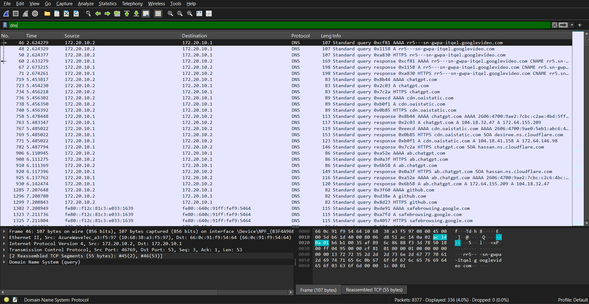
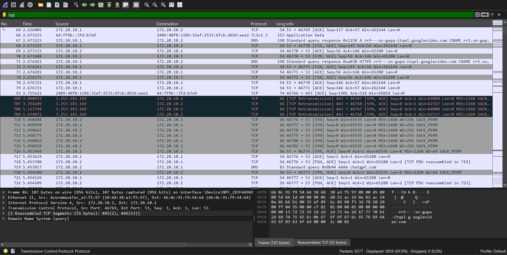

# 🛡️ Task 5: Capture & Analyze Network Traffic using Wireshark  

**👤 Author:** *NIKITA SHINDE*  
**📅 Date:** *11 August 2025*  

---

## 🎯 Objective  
To **capture live network packets** and **analyze basic protocols** like **DNS** and **TCP** using Wireshark for better understanding of real-time network communication.

---

## 🧰 Tools Used  
- 🖥 **Tool**: Wireshark v4.x (Free & Open Source)  
- 💻 **System**: Windows 10  
- 📡 **Network Interface**: Wi-Fi  

---

## 📜 Steps Performed  

1. 📥 **Installed** Wireshark on the system.  
2. 📶 Selected **Wi-Fi** interface and started **packet capture**.  
3. 🌐 Generated traffic by:  
   - Visiting sites: `chatgpt.com`, `google.com`, `github.com`  
   - Running `ping` commands in terminal  
4. ⏱ Stopped capture after ~2 minutes.  
5. 🎯 Applied filters for focused analysis:  
   - `dns`  
   - `tcp`  
6. 🔍 Inspected packets for **source/destination IP**, **protocol type**, and **payload data**.  
7. 📸 Took screenshots for documentation.  

---

## 🔍 Protocol Analysis  

### 1️⃣ DNS (Domain Name System)  
**Purpose**: Resolves domain names (like `chatgpt.com`) to IP addresses.  

📷 *Example DNS Capture:*  
  

**Observations**:  
- Requests & responses show **query types** (A, AAAA, CNAME)  
- Domain lookups for websites visited during capture  
- IPv4 and IPv6 resolution in action  

---

### 2️⃣ TCP (Transmission Control Protocol)  
**Purpose**: Reliable communication between devices.  

📷 *Example TCP Capture:*  
  

**Observations**:  
- Handshakes (**SYN**, **ACK**) and retransmissions visible  
- TCP segments reassembled into complete data  
- Some retransmissions observed due to packet loss or delays  

---

## 📊 Network Traffic Flow Diagram  

```mermaid
sequenceDiagram
    participant User_Device
    participant DNS_Server
    participant Web_Server

    User_Device->>DNS_Server: 🌐 DNS Query (chatgpt.com)
    DNS_Server-->>User_Device: 📩 DNS Response (IP Address)
    User_Device->>Web_Server: 🤝 TCP SYN (Start connection)
    Web_Server-->>User_Device: 🔄 TCP SYN-ACK
    User_Device->>Web_Server: ✅ TCP ACK (Connection established)
    User_Device->>Web_Server: 📤 HTTP/HTTPS Request
    Web_Server-->>User_Device: 📥 HTTP/HTTPS Response
```

---

## 🔑 Key Findings  

1. ✅ **Captured Live Traffic** – Successful packet capture on Wi-Fi interface during browsing & pings.  
2. ✅ **Identified Core Protocols** – DNS, TCP, and some HTTPS traffic detected.  
3. ⚠ **Plaintext in HTTP** – Demonstrates risk of non-encrypted communication.  
4. 🧠 **Hands-on Understanding** – Learned protocol behavior, filtering, and packet inspection.  

---

## 📂 Files Provided  
- `capture.pcapng` – Packet capture file  
- `wireshark1.png` – DNS filter screenshot  
- `wireshark2.png` – TCP filter screenshot  
